 
---
 
<!-- PRESENTACIÓN EN ESTILO CÓDIGO -->

  <table>
    <tr>
      <td width="50%">
        
      </td>
      <td width="50%">
        <pre>
<code class="language-js">
// Presentación

const developer = {
  name: "0xInterruptHandler",
  role: "System & Software Engineer",
  specialties: [
    "Web Cybersecurity",
    "Backend Architectures",
    "Reverse Engineering"
  ],
  techStack: {
    languages: ["JavaScript", "TypeScript", "C/C++", "Python"],
    frameworks: ["Node.js", "Express", "React"],
    tools: ["Neovim", "Docker", "GitHub Actions"]
  } 
};
        </code>
        </pre>
      </td>
    </tr>
  </table>

---
<!--   GRID DE MÉTRICAS -->

<!-- GRID DE MÉTRICAS EN DOS COLUMNAS -->

<!-- MÉTRICAS EN DOS COLUMNAS -->

  <table>
    <tr>
      <td width="50%" align="center" valign="top">
        
      </td>
      <td width="50%" align="center" valign="top">
        
      </td>
    </tr>
    <tr>
      <td colspan="2" align="center" valign="top">
        
      </td>
    </tr>
    <tr>
      <td colspan="2" align="center" valign="top">
        
      </td>
    </tr>
  </table>

<!-- LENGUAJES Y BADGES -->
##  Lenguajes y Herramientas

  
  
  
  
  
  
  
  
   
      
      
       
      
        
    
     
     
 

 

  
 
 
